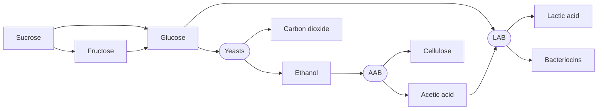
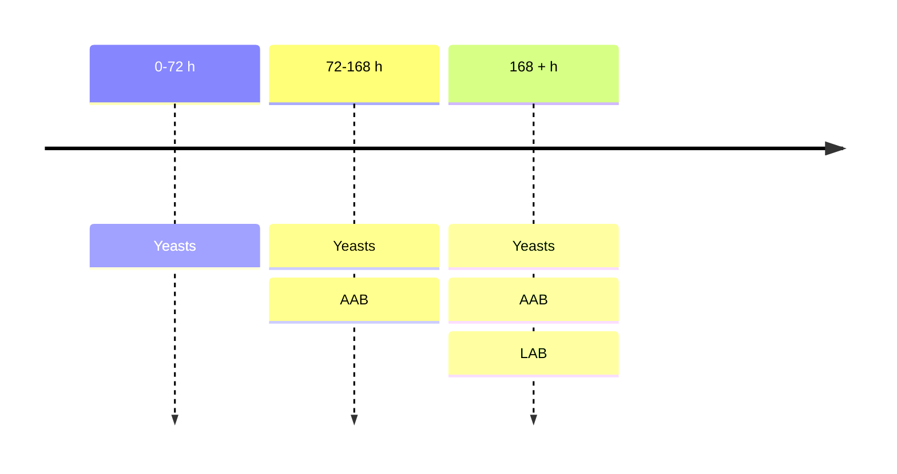

## Abstract 

Microbial consortia have recently been proposed as robust biochemical production systems to make up for the limitations of single strains. These are hampered by metabolic burden, where an individual microorganism's metabolism is strained by taxing metabolic pathways engineered into them. In this article, we explore how kombucha SCOBY (Symbiotic Culture of Bacteria and Yeasts) could serve as platform for developing future coculture systems, by first breaking it down into its mechanisms and seeing how they could be adapted and augmented for novel biochemical applications beyond kombucha fermentation.



	A close-up view of a batch of kombucha in a glass jar being fermented with a layer of SCOBY. Photo by <a href="https://unsplash.com/@to_metz?utm_source=unsplash&utm_medium=referral&utm_content=creditCopyText">Tim-Oliver Metz</a> on <a href="https://unsplash.com/photos/clear-glass-jar-with-brown-liquid-cZIiXRX9PqE?utm_source=unsplash&utm_medium=referral&utm_content=creditCopyText">Unsplash</a>.

## Introduction

Metabolic engineering is the practice of genetically modifying microorganisms to express pathways that produce metabolites of interest, such as industrial chemicals, pharmaceuticals, and fuels. Most efforts in this field have revolved around engineering pathways into single strains, but these often struggle to sustain them, requiring significant expenditures of energy, precursors and cofactors. This is known as metabolic burden, and it plagues biochemical engineering with poor yields.

In nature, microbes work around this by forming consortia and distributing pathways between strains, thus dividing metabolic labor. Coculturing approaches imitate these naturally-occurring communities and have thus made substantial productivity gains in biochemical synthesis systems by mitigating excessive metabolic burden in single cells. SCOBY (Symbiotic Culture of Bacteria and Yeasts) is an example of a natural microbial consortium, mainly used for fermenting sweetened tea into kombucha. 

To expand the toolbox of synthetic biologists, this article reverse engineers SCOBY and investigates how it could be repurposed into a general-purpose biochemical production platform, satisfying the requirements of future coculturing systems.

## Reverse Engineering SCOBY

SCOBY appears on top of the fermenting solution as a white, slippery biofilm made of cellulose produced by the acetic acid bacterium *Komagataeibacter xylinus*. Though the exact composition varies greatly across kombucha preparations, its microbial population can be divided into three groups: yeasts, acetic acid bacteria (AAB) and lactic acid bacteria (LAB). They support each other primarily via cross-feeding (Figure 1) and appear in successional waves (Figure 2).

	Figure 1.  Diagram of the main cross-feeding interactions and products in SCOBY. Pill-shaped nodes represent microorganisms while blocks represent compounds and metabolites. Other interactions, such as polyphenol metabolism and nitrogen fixation, are not shown.

	Figure 2. Timeline of successional waves of yeasts, acetic acid bacteria (AAB) and lactic acid bacteria (LAB) in SCOBY. 

### Yeasts

Yeasts (*e.g.*, *Saccharomyces cerevisiae*) first appear (0-72 h) and initiate fermentation, secreting  enzymes that hydrolyze sucrose into glucose and fructose. They consume this glucose to carry out anaerobic fermentation, producing carbon dioxide and ethanol.

### Acetic Acid Bacteria (AAB)

AAB (*e.g.*, *K. xylinus*) later appear (72-168 h) and oxidize the accumulated ethanol into acetic acid. They additionally synthesize the cellulosic biofilm, on top of which they live to obtain the oxygen required for aerobic fermentation. Some bacteria may additionally fixate nitrogen (*e.g.*, *Acetobacter nitrogenifigens*).

### Lactic Acid Bacteria (LAB)

LAB (*e.g.*, *Lactobacillus harbinensis*) last appear (168 h) and metabolize glucose and acetic acid into lactic acid and other organic acids, further acidifying the solution. They may also produce bacteriocins, antimicrobial peptides that inhibit pathogenic bacteria.

### Emergent Functions of SCOBY

The diversity of species and their shared biochemical processes result in emergent functions:

**Diversified carbon sources**: The colony as a whole is able to utilize various carbon sources, as is the case of *K. xylinus*, which can oxidize ethanol, glucose, sucrose and glycerol into gluconic acid.

**Cross-feeding**: The species found in SCOBY produce metabolic byproducts that feed each other, encouraging symbiosis between auxotrophs and stable populations.

**Waste disposal**: The accumulation of ethanol and other potentially toxic byproducts is mitigated by microorganisms that can effectively utilize them in a cascade reaction.

**Metabolic niches**: The cellulose biofilm separates the culture into two compartments. The upper-layer above the biofilm is rich in oxygen and suitable for aerobic fermentation, while the solution below it is deprived of oxygen and thus accommodates anaerobic fermentation.

**Antimicrobial defense**: The accumulation of acids, the lack of oxygen in the solution and the production of bacteriocins prevents invasions of pathogenic bacteria, including gram-negative and gram-positive bacteria.

## Reengineering SCOBY

The emergent functions that we have identified in SCOBY allow for diverse applications. For instance, the diversity of species provides many hosts for breaking up the metabolic labor involved in a pathway to be engineered. Much like how ethanol is consumed, pathways that mitigate the accumulation of toxic intermediates and waste products can be programmed into the colony, ensuring the survival of its members while potentially minimizing feedback inhibition. This same diversity also enables the colony to utilize various carbon sources, reducing competition, encouraging symbiosis through cross-feeding, and potentially enabling the use of cheap substrates (*e.g.*, biomass, waste). Such diversity can also help create coculture systems that are more resilient to environmental fluctuations thanks to the redundancy afforded by multiple strains that carry out similar processes.

The self-assembled aerobic and anaerobic compartments defined by the cellulosic biofilm can also accommodate diverse metabolic requirements, allowing scientists to pair strains that would otherwise have to be cultured separately. Along with the organic acids and the bacteriocins, the biofilm protects the community, making SCOBY an autonomous culture in terms of defense.

Similarly to other microbial consortia, SCOBY can thus be tailored to fulfill certain functions, and even augmented by genetic engineering and *in silico* modelling.

### Designing Minimal Consortia

Simpler, minimal consortia made from a subset of the strains found in SCOBY can be developed to retain key metabolic functions while ensuring reproducibility and simplicity in the interactions that may need to be modelled. This has previously been done before for a synthetic culture named Syn-SCOBY, which included *S. cerevisiae* and *Komagataeibacter rhaeticus*. 

### Adding and Modifying Microbes

Conversely, microbes can be added to a SCOBY colony, adding new metabolic pathways and capabilities to the microbial system. For instance, a culture could be inoculated with *Bacillus subtilis* engineered to produce antimicrobial peptides of interest. Some could additionally be added provided that they have compatible metabolic pathways, such as *Eubacterium limosum*, which produces acetic acid, a potential substrate for LAB, when metabolizing carbon monoxide.

Established microbes in SCOBY could further be modified to optimize certain functions. For instance, *K. xylinus* can be modified to improve cellulose synthesis and thus fortify the biofilm matrix. Quorum sensing could also be engineered into *Komagataeibacter* strains to modulate cellulose production, and more generally, genetic circuits could be integrated as well to modulate production of acetic acid.

### Systems Biology Modelling of SCOBY

SCOBY comprises a complex network of microbial interactions. Though we have yet to fully map these out, they will be essential in building community-wide models that predict interactions, metabolite yields and the spatiotemporal evolution of microbial populations.  Machine learning architectures (*e.g.*, neural networks), simulations (*e.g.*, digital twins) and mathematical models (*e.g.*, flux balance analysis) will underpin future computational models, enabling us to optimize metabolic processes for stability and high productivity.

Such approaches have already been successfully in modelling interactions and integrating environmental parameters (*e.g.*, temperature, pH, substrate concentration, duration) to predict certain outcomes. For instance, XGBoost has been applied to predict bacterial cellulose production of SCOBY based on culture conditions, identifying along the way the most important of these for making predictions. GANs (Generative Adversarial Networks) can be used to simulate interactions and nutrients shifts, and more generally, deep neural networks have previously been used to predict microbial populations in consortia across time. Though most implementations have so far focused on simpler, single-strain cultures for fermented foods (*e.g.*, yogurt, wine, beer), their success signals that they will evolve to handle consortia of increasing complexity. Minimal consortia built from select, well-known species could become stepping stones in this direction, serving as simpler targets to validate modelling strategies.

### Profiling SCOBY

SCOBY has yet to be fully profiled, but innovative analytical methods, such as gas chromatography-mass spectrometry (GC-MS), liquid chromatography-mass spectrometry (LC-MS) and multidimensional gas chromatography (MDGC) will help detect and quantify metabolites along with advanced biosensors for real-time monitoring, further informing the design of *in silico* models. Multiomics can further help correlate gene expression and metabolic behaviors.

## Conclusion

Our understanding of SCOBY and our capacity to model community-wide interactions have yet to evolve in order to guide modifications intelligently. Analytical techniques, multiomics and *in silico* modelling will pave the way towards this.  For now, however, we have explored the emergent functions of SCOBY that make it an attractive solution for developing coculturing systems. It is a system with built-in antimicrobial defense, symbiotic interactions, cross-feeding, different modes of fermentation and the ability to use diverse carbon sources. These features will perhaps one day make of SCOBY a microbial platform on which we will build the biochemical production systems of tomorrow.